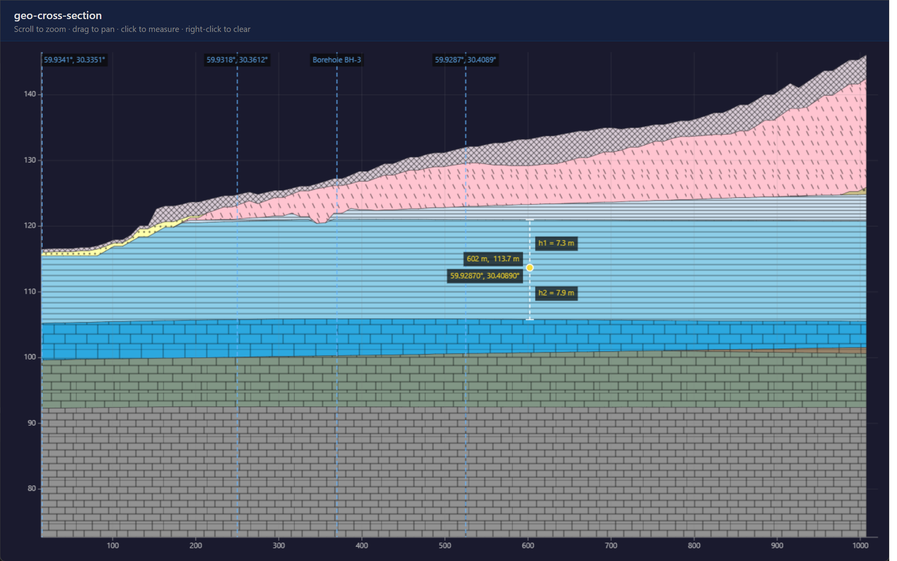

# geo-cross-section

Zero-dependency TypeScript/Canvas 2D library for rendering interactive 2D geological cross-sections in web browsers.



## Features

- Renders filled layer polygons with optional PNG hatch overlay patterns
- Layers absent at certain points are automatically tapered to a knife-edge
- Vertical reference lines with geographic coordinates (lat/lon) and custom labels
- Click to place a measurement marker showing depth to upper/lower layer boundaries
- Latitude/longitude interpolated from reference lines shown on the click marker
- Right-click to remove the marker
- Hover tooltip showing layer name and cursor coordinates
- Hover dot that follows the cursor while over a layer
- Zoom (scroll wheel, capped at original scale) and pan interactions
- X / Y axes with configurable tick count, grid, and label styles
- Automatic resize via `ResizeObserver`
- Zero runtime dependencies — pure Canvas 2D, no D3, no SVG

## Install

```bash
npm install geo-cross-section
```

## Quick start

```ts
import { CrossSection } from 'geo-cross-section'

const cs = new CrossSection(
  document.getElementById('container'),
  {
    series: [
      {
        distance: 0,
        layers: [
          { id: 'sand',  top: 120, bottom: 110 },
          { id: 'clay',  top: 110, bottom: 95  },
        ],
      },
      {
        distance: 500,
        layers: [
          { id: 'sand',  top: 118, bottom: 105 },
          { id: 'clay',  top: 105, bottom: 90  },
        ],
      },
    ],
    layerInfo: [
      { id: 'sand', name: 'Fine sand',  color: '#f5dfa0' },
      { id: 'clay', name: 'Blue clay',  color: '#a0b4c8' },
    ],
  },
)
```

The container element must have an explicit width and height (CSS).

## Data format

### `CrossSectionData`

```ts
interface CrossSectionData {
  series:     BoundsPoint[]
  layerInfo?: LayerInfo[]
  refLines?:  RefLine[]
}
```

#### `BoundsPoint`

| Field      | Type            | Description                                              |
|------------|-----------------|----------------------------------------------------------|
| `distance` | `number`        | Horizontal distance along the transect (any unit)        |
| `layers`   | `BoundsLayer[]` | Layer boundaries at this point, ordered top → bottom     |

#### `BoundsLayer`

| Field    | Type     | Description                                                    |
|----------|----------|----------------------------------------------------------------|
| `id`     | `string` | Layer identifier — **must be stable across all series points** |
| `top`    | `number` | Elevation of the top boundary                                  |
| `bottom` | `number` | Elevation of the bottom boundary                               |

#### `LayerInfo` (optional)

Provides visual and label metadata per layer. All fields except `id` are optional.

| Field   | Type     | Default         | Description                                        |
|---------|----------|-----------------|----------------------------------------------------|
| `id`    | `string` | —               | Matches a `BoundsLayer.id`                         |
| `name`  | `string` | `"Layer ${id}"` | Display name in tooltip                            |
| `color` | `string` | `'#ffffff'`     | CSS fill colour                                    |
| `hatch` | `string` | —               | URL to a PNG tile used as an overlay hatch pattern |

#### `RefLine` (optional)

Vertical reference lines positioned at known geographic coordinates.

| Field      | Type     | Description                                                       |
|------------|----------|-------------------------------------------------------------------|
| `distance` | `number` | Horizontal position along the transect (same unit as `series`)    |
| `lat`      | `number` | Geographic latitude in decimal degrees                            |
| `lon`      | `number` | Geographic longitude in decimal degrees                           |
| `label`    | `string` | Optional badge label (default: formatted `lat / lon`)             |

When `refLines` are provided, clicking on the section also displays interpolated lat/lon for the clicked point.

Layers may be absent at some series points; the library tapers them to a knife-edge automatically.

## Constructor

```ts
new CrossSection(container: HTMLElement, data: CrossSectionData, options?: CrossSectionOptions)
```

## Options (`CrossSectionOptions`)

All options and their sub-fields are optional. Defaults are shown below.

### Top-level

| Option             | Type                | Default                                          | Description                                |
|--------------------|---------------------|--------------------------------------------------|--------------------------------------------|
| `padding`          | `Partial<Padding>`  | `{top:40, right:20, bottom:40, left:55}`         | Canvas padding in px                       |
| `measurementUnit`  | `string`            | `'m'`                                            | Unit label appended to all value displays  |
| `hatchPatternSize` | `number`            | `48`                                             | On-screen PNG tile size in px              |
| `tooltipContainer` | `HTMLElement`       | `document.body`                                  | Element the tooltip `<div>` is appended to |

### `axes`

| Option       | Type     | Default                       |
|--------------|----------|-------------------------------|
| `axisColor`  | `string` | `'rgba(180,180,180,0.7)'`     |
| `gridColor`  | `string` | `'rgba(120,120,120,0.18)'`    |
| `labelColor` | `string` | `'rgba(200,200,200,0.9)'`     |
| `font`       | `string` | `'11px system-ui,sans-serif'` |
| `tickLength` | `number` | `5`                           |
| `xTickCount` | `number` | `8`                           |
| `yTickCount` | `number` | `6`                           |

### `layer`

| Option        | Type     | Default                |
|---------------|----------|------------------------|
| `borderColor` | `string` | `'rgba(40,40,40,0.4)'` |
| `borderWidth` | `number` | `1`                    |

### `marker`

| Option              | Type               | Default                       |
|---------------------|--------------------|-------------------------------|
| `pointColor`        | `string`           | `'rgba(255,220,40,0.9)'`      |
| `dotRadius`         | `number`           | `5`                           |
| `dotRingColor`      | `string`           | `'#fff'`                      |
| `hoverColor`        | `string`           | same as `pointColor`          |
| `lineColor`         | `string`           | `'rgba(255,220,40,0.5)'`      |
| `lineWidth`         | `number`           | `1.5`                         |
| `lineDash`          | `[number,number]`  | `[5, 4]`                      |
| `tickSize`          | `number`           | `6`                           |
| `depthLabelColor`   | `string`           | same as `pointColor`          |
| `depthLabelBg`      | `string`           | `'rgba(10,10,10,0.72)'`       |
| `depthLabelPadding` | `number`           | `5`                           |
| `font`              | `string`           | `'11px system-ui,sans-serif'` |

### `tooltip`

| Option         | Type     | Default                           |
|----------------|----------|-----------------------------------|
| `background`   | `string` | `'rgba(10,10,10,0.82)'`           |
| `color`        | `string` | `'#fff'`                          |
| `padding`      | `string` | `'5px 11px'`                      |
| `borderRadius` | `string` | `'5px'`                           |
| `font`         | `string` | `'13px/1.5 system-ui,sans-serif'` |
| `shadow`       | `string` | `'0 2px 10px rgba(0,0,0,0.35)'`   |
| `zIndex`       | `number` | `9999`                            |
| `whiteSpace`   | `string` | `'nowrap'`                        |

### `refLine`

| Option         | Type              | Default                       |
|----------------|-------------------|-------------------------------|
| `color`        | `string`          | `'rgba(100,180,255,0.85)'`    |
| `width`        | `number`          | `1.5`                         |
| `dash`         | `[number,number]` | `[6, 4]`                      |
| `labelColor`   | `string`          | same as `color`               |
| `labelBg`      | `string`          | `'rgba(10,10,10,0.72)'`       |
| `font`         | `string`          | `'11px system-ui,sans-serif'` |
| `labelPadding` | `number`          | `4`                           |

## Instance methods

| Method         | Description                                               |
|----------------|-----------------------------------------------------------|
| `render()`     | Redraw (called automatically after every interaction)     |
| `update(data)` | Replace data and reset zoom/pan                           |
| `destroy()`    | Remove event listeners, `ResizeObserver`, and canvas      |

---

## Hatch patterns

Hatch tiles are PNG images overlaid on the fill colour using the Canvas `createPattern` API. Supply tile URLs via `LayerInfo.hatch`. The tile is repeated and scaled to `hatchPatternSize` px on screen (stays constant size regardless of zoom level).

Tiles for a Vite project can be loaded with `import.meta.glob`:

```ts
const hatchModules = import.meta.glob('/public/hatches/*.png', {
  query: '?url', import: 'default', eager: true,
}) as Record<string, string>

const layerInfo = myLayers.map(layer => ({
  ...layer,
  hatch: hatchModules[`/public/hatches/${layer.hatchCode}.png`],
}))
```

---

## Reference lines and lat/lon interpolation

```ts
const cs = new CrossSection(container, {
  series: [ /* … */ ],
  refLines: [
    { distance:    0, lat: 55.7558, lon: 37.6173, label: 'Start' },
    { distance: 1000, lat: 55.7620, lon: 37.6310, label: 'End'   },
  ],
})
```

- Reference lines are drawn as dashed vertical lines spanning the full section height.
- Each line shows a small badge with the label (or formatted lat/lon when no label is given).
- When `refLines` are defined, clicking on the section computes interpolated lat/lon for the click position and shows it in the marker badge.

---

## Browser support

Requires **Canvas 2D API** and **`ResizeObserver`** — all modern browsers (Chrome, Firefox, Safari, Edge).

## License

MIT
